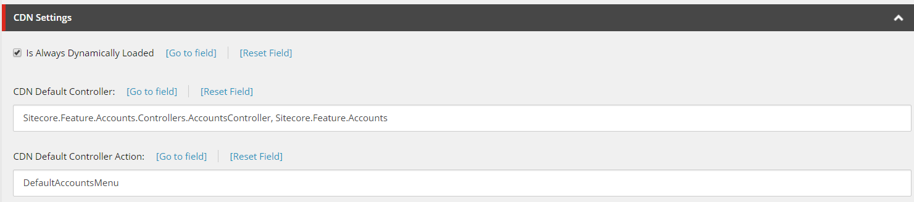
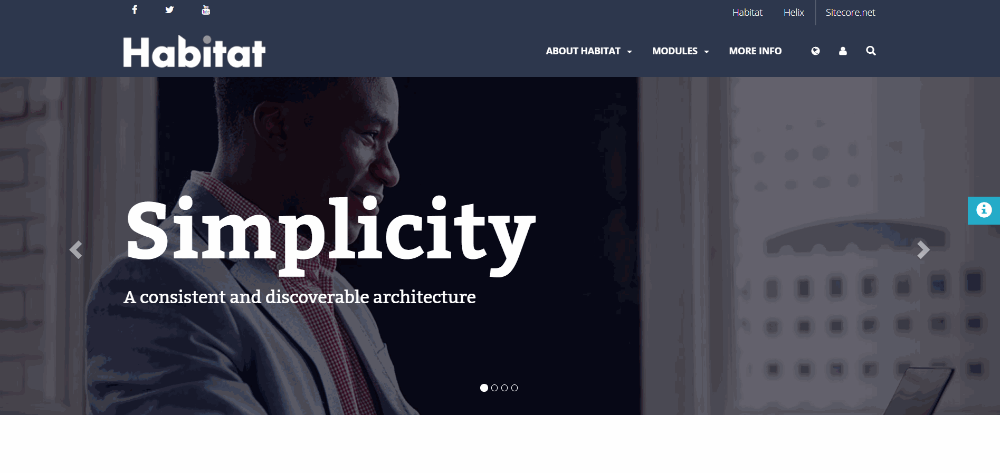

# Sitecore-CDN
Sitecore module to allow personalization and tracking when used with a CDN

## Configuration
* Update `<setting name="Symposium.Feature.CDN.OriginalHost" value="symposium2019cdndemo-single.azurewebsites.net" />` in `Feature.CDN.config` to match Sitecore origin (non CDN) host.
* Mark all renderings that should always be dynamically loaded with `Is Always Dynamically Loaded`. 
* **[Optional]** If custom default rendering is needed specify `CDN Default Controller` & `CDN Default Controller Action` for Controller renderings & `CDN Default Path` for View renderings. These fields are used instead of default spinner if needed.

* Add `data-original-host="@Sitecore.Configuration.Settings.GetSetting("Symposium.Feature.CDN.OriginalHost")"` to `body` tag of all layouts. This is required by JS to send requests from CDN to origin Sitecore.
* Add FXM beacon script to all layouts. E.g. ``
* Add links to CSS & JS from module to all layouts:   
  * `<link href="/styles/cdn/cdn.css" rel="stylesheet">`
  * ``
* Configure CDN to pull everything from Sitecore origin domain.

## Implementation
* Module provides possibility to load only static content on initial page load
* All personalized content or content marked as `Is Always Dynamically Loaded` is loaded via AJAX from origin Sitecore host
* FXM is used to provide analytics to CDN website

## Enjoy :)

